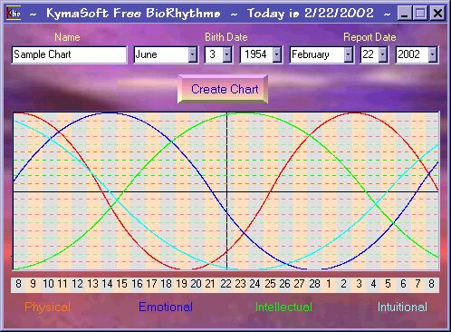



## Free BioRhythm

### Description

An update of my previous submission. Now includes a nice background pic, cleaned up code and quick forward/back movement to different dates. Your comments and/or votes appreciated.
 
### More Info
 

             |
---                |---
**Submitted On**   |2002-02-22 12:15:28
**By**             |[Michael Hebert](https://github.com/Planet-Source-Code/PSCIndex/blob/master/ByAuthor/michael-hebert.md)
**Level**          |Beginner
**User Rating**    |4.8 (19 globes from 4 users)
**Compatibility**  |VB 6\.0
**Category**       |[Complete Applications](https://github.com/Planet-Source-Code/PSCIndex/blob/master/ByCategory/complete-applications__1-27.md)
**World**          |[Visual Basic](https://github.com/Planet-Source-Code/PSCIndex/blob/master/ByWorld/visual-basic.md)
**Archive File**   |[Free\_BioRh569572232002\.zip](https://github.com/Planet-Source-Code/michael-hebert-free-biorhythm__1-32049/archive/master.zip)

